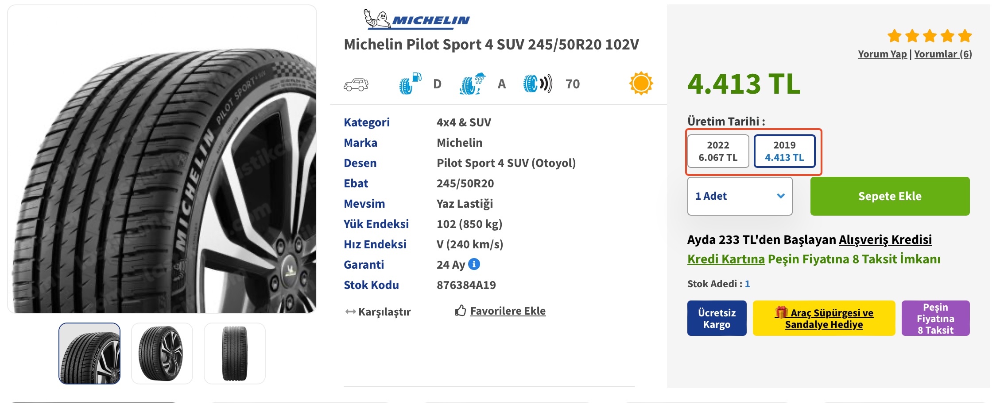

# 🕵 Lastik Alırken Dikkat Edilmesi Gerekenler

## ☀️ Yaz - Kış Lastik

* Yaz ve kış için ayrı lastik alacaksınız, lastikçilerde otel hizmeti ile sezonluk ücretle lastiklerinizi saklayabilirsiniz
  * 2023 fiyatı sezonluk 500₺ benzeri bir fiyattı
  * Sezon sonunda lastikçinize gidip değiştirtiyorsunuz
* CrossClimate alırsanız yaz, kış lastik değiştirmenize gerek yok ama performans ve konforda düşüşe sebep olur

## 📏 Lastik Ölçümleri

* Orjinal lastik ölçütlerinizi öğrenip ona uygun araba lastiğini almanızda fayda var
* Lastik diş derinliğinin yasal sınırı 1,6mm’dir ama 3mm’ye indiğinde değiştirilmesi tavsiye edilir
* 255 50 R20, bir lastiğin boyut ve özelliklerini ifade eden bir ölçüdür. Bu ölçüdeki her sayı ve harf, lastiğin farklı bir özelliğini temsil eder:
  1. 255: Lastiğin genişliği milimetre (mm) cinsinden ölçülür. Bu durumda, lastik 255 mm genişliğindedir.
  2. 50: Yanak yüksekliği, lastiğin genişliğine oranla yüzde olarak ifade edilir. Bu örnekte, yanak yüksekliği lastik genişliğinin %50'sidir. Bu, yanak yüksekliğinin 255 mm'nin %50'si olan 127,5 mm olduğu anlamına gelir.
  3. R: Lastik yapısını belirten bir harftir. "R" radyal yapıya sahip olduğunu gösterir, bu da lastik katmanlarının merkezi çevresine dik olarak yerleştirildiği anlamına gelir. Radyal lastikler, daha iyi yol tutuşu ve daha uzun ömür sağlar.
  4. 20: Jant çapını inç cinsinden gösterir. Bu durumda, lastik 20 inç çapında bir janta uyacak şekilde tasarlanmıştır.
* Özetle, 255 50 R20 ölçüsündeki bir lastik, 255 mm genişliğinde, %50 yanak yüksekliğine sahip, radyal yapıya sahip ve 20 inç çapında bir janta uyumlu bir lastiktir.

## 🗓️ Lastiğin üretim yılı

* Lastik sıfır olsa bile üretim yılı da lastiğin ömrünü etkiler
* Lastik ömrü üretim yılından itibaren 10 yıldır, bu süreyi aşan lastikleri kullanmayın
*   Üretim yılı daha eski lastikler kısa ömürlü olduğunda ucuz alır

    <figure><figcaption></figcaption></figure>
