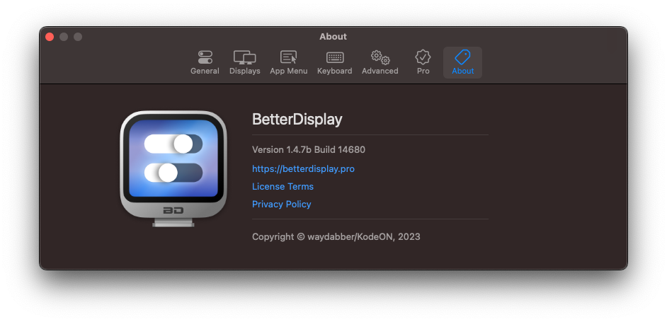
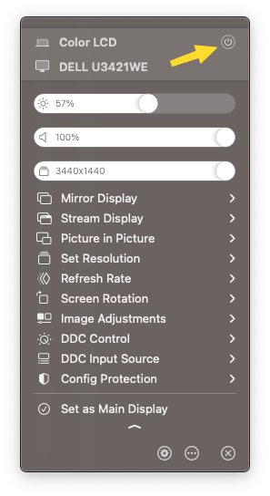

# 🔆 Macbook ekranını kapatma ve parlaklık sınırını zorlama

* [BetterDisplay](https://github.com/waydabber/BetterDisplay) uygulaması ile yapılabiliyor
*   İsterseniz Pro sürümü ile Mac'inizin ekranını kapatıp, harici monitorün ekranın açık tutabiliyorsunuz

    * Mac'in klavyesini ve tracpadini kullanıp, harici ekran kullananlar için ideal bir çözüm
    * Öncesinde Mac'in ekranını ayalar kısmından monitörünüzün ekranını yansıtması için ayarlayın

    

    <figure><figcaption></figcaption></figure>

    

    

    <figure><figcaption></figcaption></figure>

    

