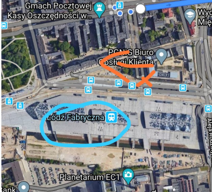
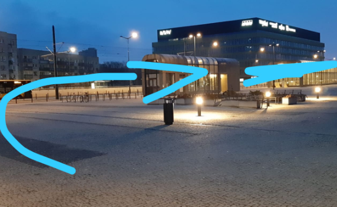
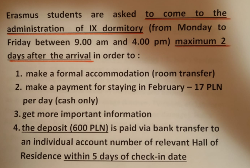
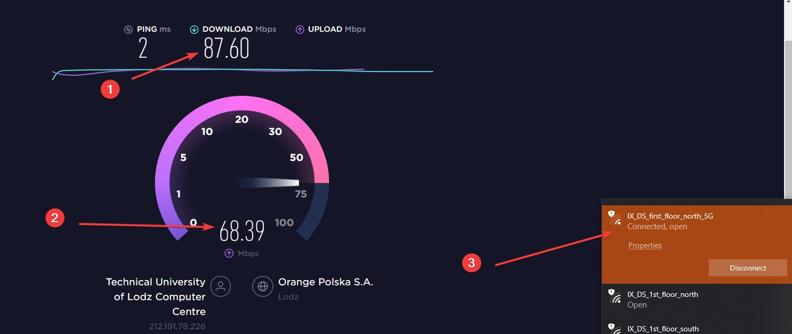
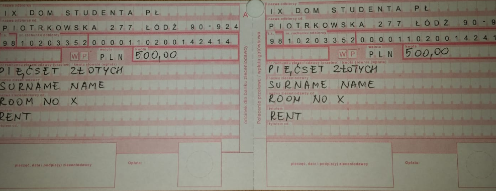
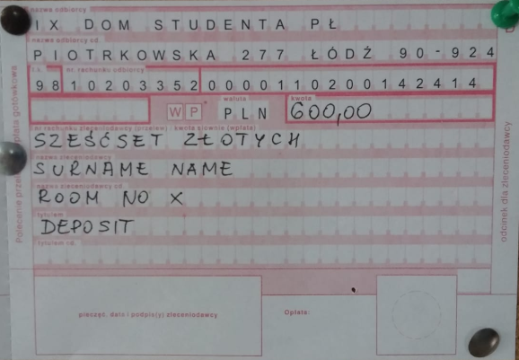

# ✈️ Polonya'da Erasmus

## 🏫 Lodz University of Technology \(TUL\) Erasmus Dersleri

* Kendi gittiğim okul olan TUL için seçilebilen derslerin listesini PDF'e ekledim
* Ders kodlarını PDF üzerinde aratarak, aradığınız dersleri hızlıca bulabilirsiniz



## 🚶‍♂️ Yurda geliş

* Sabiha gökçen Pegasus ile Berlin Schonefeld Hava limanı
* Berlin Schonefeld FlixBus ile Lodz Fabryczna durağına gelinir
* Otobüs durağına alttaki resimleri takip ederek gidilir

## 🚌 Otobüs Notları:

* Biletler otobüs içerisinden alınır
* 3 pln olan üst kısımdaki seçilir
* Katla, temassızla ödenebilir
* Ziraat kartı varsa öğrenci oluyor
* Radwanska - Kampul PL durağında inilir

## 🎫 Yurda giriş:

* Mentörünüz ile birlikte yapılması tavsiye edilir
* Resepsiyon İngilizce bilmez, ama administrator İngilizce bilir
* Pasaportunuzu resepsiyona verdikten sonra anahtarınız size ve~~r~~ilecektir

## 📝 9. Yurt Notları

* 💰 Ücreti 500 PLN \(diğer yurtlar 440 PLN\)
* 🙄 Biraz eski gözüküyor odalar
* 🦄 Ama herkesin kendisine ait bir odası var
* 👪 Her iki kişi için 1 banyo, her kat için ortak mutfak var
* 🚀 Eğer 5G ağına bağlanırsanız; internet aşırı hızlı
* 😪 Yurtta sadece administrator \(yönetici\) İngilizce bilmekte \(öğrenciler hariç 💁‍♂️\)


📢 Google Maps yorumuma [buradan](https://goo.gl/maps/j6MPrujYwpWX5yUz8) bakabilirsin


## 💸 Yurt Ücreti Ödeme

* Yurda giriş yaptıktan sonra kesinlikle **administrator** ile görüşmeniz lazımdır
* Gerekli açıklamaları size yapacaktır ama ben yine de aşağıya detayları yazayım
* Reception önündeki kağıtlardan alıp **adınız, soyadınız ve ödenecek miktarı** yazacaksınız
* Post Office üzerinden ödeme yapmanız gerekecek, [**Sukcesja**](https://goo.gl/maps/Kt3CxorF1v1S8ePC8) içerisinde 2. katta bulabilirsin
* **Post Office**'i [**Sukcesja**](https://goo.gl/maps/Kt3CxorF1v1S8ePC8) içerisinde 2. katta bulabilirsin \(Genellikle sıra oluyor ve ağır işliyor\)
* Bu işlem için **3.5 PLN** vermeniz gerekmektedir

## 🛍️ Alışveriş Notları

* En uygun fiyatlarda satan marketler [**Dino**](https://goo.gl/maps/z7R6KvGf95YoS7js5) ve [**Lidl**](https://goo.gl/maps/xqfhmXL29XVi8N6R9)\*\*\*\*
* \*\*\*\*[**Manufactura**](https://goo.gl/maps/Wob7D51qytYRY51RA) alışveriş merkezi üzerinden üçlü priz vs gibi malzemeler alınabilir
* \*\*\*\*[**Sukcesja**](https://goo.gl/maps/Kt3CxorF1v1S8ePC8) alışveriş merkezi ile alttaki ihtiyaçlarınızı karşılayabilirsiniz
  * Döviz işlemleri \(kantor starbucks karşısında girişte\)
  * SIM kartı işlemleri \(orange önerilir\)

## 📧 Certificate of Arrival

* Bu belgeye göre gönderen okulunuzdan hibe alırsınız
* Alıcı okula **otobüs ve uçak biletlerinizi mail olarak atıp**, istekte bulunabilirsiniz

## 💸 Para Yönetimi

* Parasal işlemlerini kesinti almayan Revolut Card ile yapabilirsiniz
* Tüm ülkelerde geçerli olup, kur fiyatlarından kesinti almaz
* Komisyon yok
* Döviz değerleri günlük kur değerlerine göre hesaplanıyor
* Para transferi aşırı hızlı ve komisyonsuz
* Başkasından para isteyebiliyorsun
* Başkasına para gönderebiliyorsun \(Sadece rehberde ismi olması kafi\)
* Faturayı 2-3 kişiye bölüp ödemeyi ayrık yapabiliyorsun
* Aylık **800 PLN para çekme** limiti vardır


‍🧙‍♂ Detaylı bilgi için 

* [Revolut web sitesine](https://www.revolut.com/)
* [Eksi sözlük yazılarına](https://eksisozluk.com/revolut--4968813)

bakabilirsin.


## 🗣 Dil Notları

### 🛒 Market Konuşmaları

| 💎 Kelime | 🔊 Okunuşu | 📝 Açıklama |
| :--- | :--- | :--- |
|  Cześć |  Çeşç | Merhaba!, Selam! |
|   Cin dobrı | Cin dobrı | Günaydın!, Tünaydın!, İyi günler! |
|  Witam | Vitam |  Hoş geldiniz |
|  Dzięki | Cienki |  Teşekkürler |
|  Proszę | Proşe |  Rica ederim |
|  Przepraszam  | Pşep’raşam |  Affedersiniz |
|  Przykro mi | Pşıkro mi |  Üzgünüm |

### 🔗 Dil Çalışma Siteleri

* [🌟 Pratik lehçe notları ve selamlaşmalar](http://lehceogren.blogspot.com/2012/01/lehcede-selamlasma-hatr-sorma.html)
* [Harflerin okunuşu ve lehçeye bakış](http://www.atilimceviri.com/index.php/ceviri-yapt-g-m-z-diller/item/403-polonyaca)

