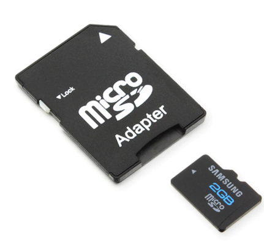
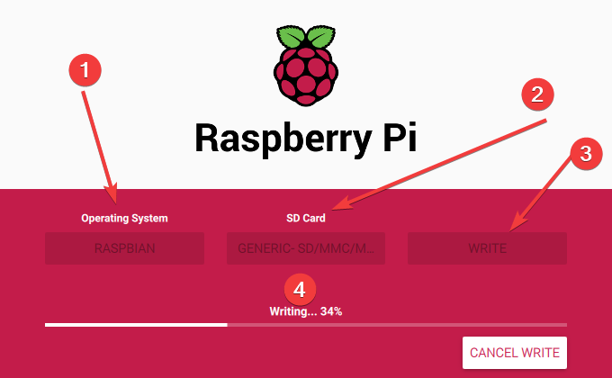
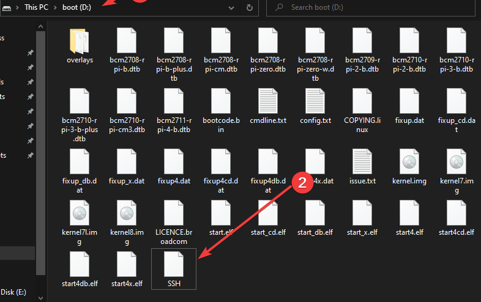
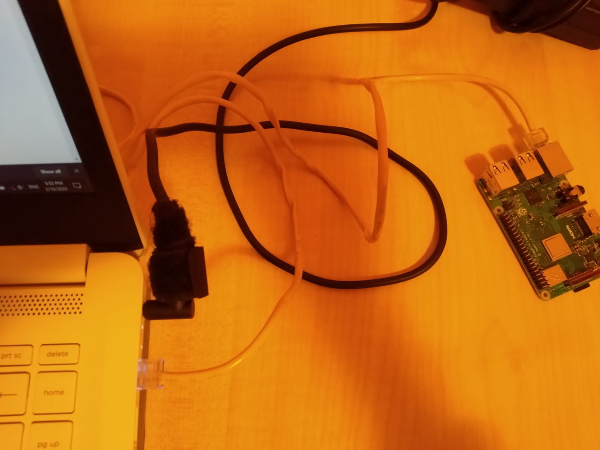
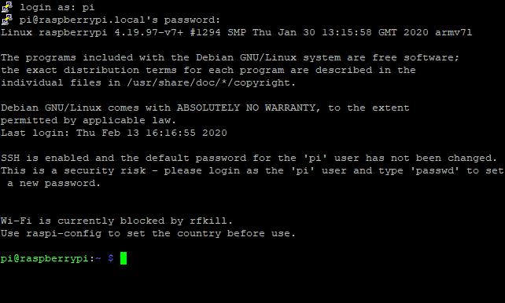
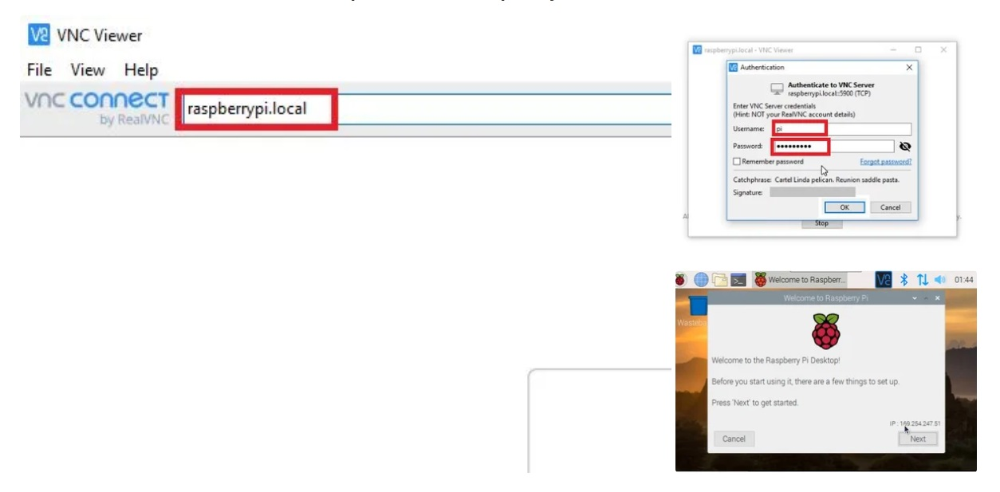
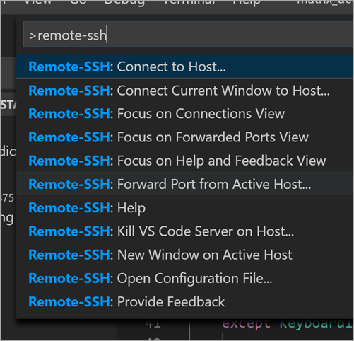
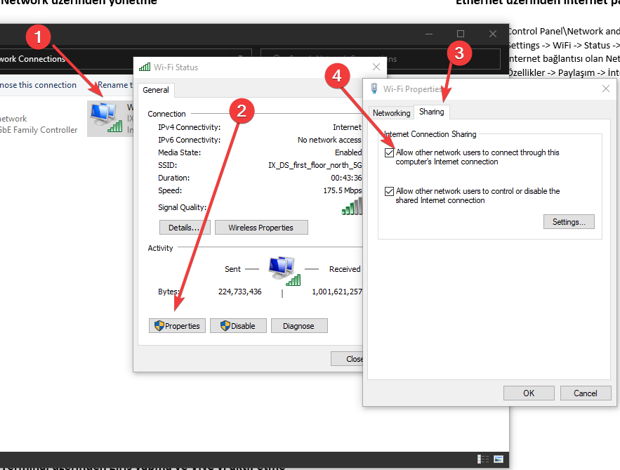

# 🍓 Raspberry Pi Kurulum, Yönetim ve Paylaşım

## 🏗️ Kurulum İşlemleri

* Kurulumdan önce **bilgisayarına SD kart takabiliyor** olman lazımdır
* SD kart aracı için [Hepsiburada olan bu linke](https://www.hepsiburada.com/syrox-16-gb-micro-sd-card-hafiza-karti-adaptorlu-p-HBV0000023NI9) bakabilirsin

* Resmi sitesinden [Rasbian işletim sistemi kurulum aracını](https://www.raspberrypi.org/downloads/) indirin
* SD kartınızı bilgisayarınıza takın ve **kurulum aracını** çalıştırın 1. İşletim sistemi ayarlarına ellemeyin, default olan kurulsun 2. SD kartınızı seçin \(Bu işlemden sonra SD kart silinir\) 3. Write butonu ile SD karta yazma işlemini tamamlayın

  Süreci bu aşamadan takip edebilirsiniz \(10-15dk alabilir\)

## 📶 Network Üzerinden Yönetme

* SD kartı bilgisayarınıza takın
* `boot (D)` dizinine `SSH` adlı uzantısız bir dosya açın

  Bu dosya **raspberry ile bilgisayarın Ethernet üzerinden iletişime geçmesini** sağlayacaktır

## 🔌 Putty ile SSH üzerinden bağlanma

* **Ethernet** kablonuzun 1 ucunu bilgisayara diğer ucunu Raspberry Pi üzerine takın

* Ardından bilgisayarınıza [Putty](https://www.chiark.greenend.org.uk/~sgtatham/putty/latest.html) uygulamasını indirin \(ücretsizdir\)
* Putty'I açın ve
  1. Host name: `raspberrypi.local`
  2. Port: `22`
  3. Ardından **Open** butonuna tıklayın \(terminal üzerinde açılacaktır\)

## 🖤 Terminal üzerinden giriş yapma ve VNC'yi aktif etme

* Login as alanına: `pi`
* Password alanına: `raspberry`
* `sudo raspi-config` komutu ile Raspberry ayarlarını açın
  * 1. kısımda yer alan **Interfacing Options** alanını seçin
  * Ardından **P3 VNC** kısmını seçip **YES** seçeneğine tıklayın

## 🖼 VNC ile bağlanma

* İlk olarak VNC Viewer uygulamasını kurun
* Uygulama üzerinden VNC server adress alanına: raspberrypi.local
* Bağlandıktan sonra çıkan ekranda
  * Login as alanına: pi

    Password alanına: raspberry

## 🌇 VS Code Üzerinden Yönetme

* İlk olarak [Remote Development](https://marketplace.visualstudio.com/items?itemName=ms-vscode-remote.vscode-remote-extensionpack&WT.mc_id=-blog-scottha) eklentisini indirin
* ✲ Ctrl ⇧ Shift P ile komut penceresini açın ve oraya `remote-ssh` yazın
* **Connect to Host..** komutuna tıklayın
* Çıkan pencereye `pi@raspberrypi` yazın ve bağlanın
  * Bağlantı sırasında şifre isteyebilir, `raspberry` deneyebilirsiniz
  * Eğer host name farklı ise Putty üzerinden **terminaldeki komut yazdığınız satırdaki ismi** kopyalayın

## 🤝 Ethernet üzerinden internet paylaşma

* **Control Panel\Network and Internet\Network Connections** alanına girin
* **Settings -&gt; WiFi -&gt; Status -&gt; Change adapter settings**
* **İnternet bağlantısı olan Network bağdaştırıcısının** üzerine sağ tıklayın
* Özellikler -&gt; Paylaşım -&gt; **İnternet paylaşımına izin ver** butonunu seçin

## 🔗 Faydalı Bağlantılar

* [How to Setup Raspberry Pi Without Monitor and Keyboard](https://www.instructables.com/id/How-to-Setup-Raspberry-Pi-Without-Monitor-and-Keyb/)
* [How to Share Internet Over Ethernet Cable](https://www.instructables.com/id/How-to-share-Internet-over-Ethernet-Cable/)
* [Visual Studio Code Remote Development over SSH to a Raspberry Pi is butter](https://www.hanselman.com/blog/VisualStudioCodeRemoteDevelopmentOverSSHToARaspberryPiIsButter.aspx)
* [Raspberry Pi as Wake On Lan Ethernet Bridge](https://www.raspberrypi.org/forums/viewtopic.php?t=92977)

