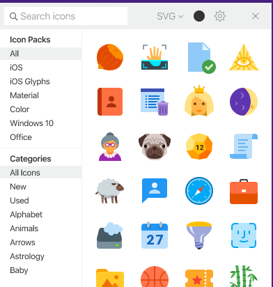

# 🎨 Tasarım Notları

## CV Notları

CV'ler için en sık kullanılan fontlar için [buraya](https://www.canva.com/learn/resume-fonts/) bakabilirsin.

> Tasarım yapma istesi olan [canva](https://www.canva.com/) üzerinden CV'ni de tasarlayabilirsin

## Windows için İkon Seti

Windows için ikon paketini [buradan](https://icons8.com/app) indirebilirsin

* Sağ alt köşede, çok hızlı bir erişimi oldukça kolaydır
* 90k ikon içerir
* Çok sık kullanılan bir pakettir
* Windows görev çubuğu üzerinden sürükle bırak mantığı ile ikon almanızı sağlıyor
* Adobe ürünleri üzerinden çalışanların kullandığını gördüm
* GUI uygulamaları yapanlar için de oldukça faydalı

## Adobe XD

> Alternatif olarak **Figma** kullanabilirsin.


📢 Adobe notlarım [🎨 Adobe XD](../uygulamalar/adobe-xd.md) alanına aktarıldı


## CamTasia Studio

Popüler ve sade arayüzlü video editleme programlarından birisidir.

### Ses İşlemleri

* Ses'i hızlnadırmak için: _Sağ tuş, Add Clip Speed_
* Sesin seviyesini düşürmek için _Sağ Tıkla -&gt; Show Properties_

## Arkaplan Müzikleri

Arkplan sesleri olmazsa olmazlardandır.

* [Ses kırpma sitesi](https://audiotrimmer.com/#)
* [Epidemic Sounds](https://www.epidemicsound.com)
* [13 Arkaplan Sesi Sitesi](https://buffer.com/library/background-music-video)

## Renk Kodları

Hazır renk kodlarının olduğu xml dosyasını \(color.xml\) [buraya](https://gelecegiyazanlar.turkcell.com.tr/sites/default/files/colors.rar) basarak indirebilirsin.

> Daha detaylı bir renk araştırması içerisindeysen, sana faydalı olabilecek bağlantıya ulaşman için [buraya](https://www.w3schools.com/colors/default.asp) tıklayabilirsin. Sol kenardaki linklerden renklerin özel olarak sıralanmış hallerini kullanman daha faydalı olacaktır.

## Kaynaklar

* [Loading Gif](https://loading.io/)
  * Kullanıcı hesabı:
  * patif@eyeemail.com
  * patif@eyeemail.com

