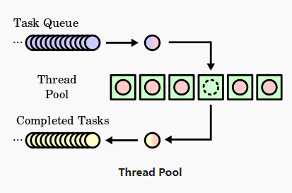

# 🧵 Thread Pool \(Executors\) Kavramı

## 👀 Thread Pool Nasıl Çalışır

* 🚄 Yapılacak işler **Task Queue** içerisinde sıraya alınır
* 🦄 Her iş, **tek tek** oluşturulan **Thread Pool** üzerindeki boş bulunan _thread_ üzerinde tamamlanır
* 💦 Tamamlanan işlerden sonra _thread_ serbest bırakılır, **Task Queue** üzerinden yeni iş alınır 

## ⭐ Thread Pool Türleri

| 💎 Tür | 📝 Açıklama | 🤔 Ne zaman tercih edilmeli |
| :--- | :--- | :--- |
| ⚡ Fixed | Sabit sayıda _thread_ ile havuz oluşturulur, boşta _thread_ yoksa işler bekletilir  | Genellikle tercih edilen en iyi durumdur |
| 🤹‍♂️ Cached | Lazım oldukça _thread_ oluşturulur,  | Uzun süreli işlemlerde kullanılmaz, sistemin kaldıramayacağı kadar thread oluşturulabilir |
| 🕐  Scheduled | Belirli aralıklarla işleri sırayla yapan _thread_ yapısı | Periyodik olarak yapılacak işler |
| 🦄 Single | Tüm işler için tek bir _thread_ yapısı oluşturulur.  | Tek bir iş için tercih edilir |
| 🧛‍♂️ Work Stealing | İş için gerekli sayıda thread oluşturur | Çoklu işlem gücü olan makinelerde, _paralelizm_ için kullanılır |

## 👨‍💼 Executor Yönetimi

| 💠 Metot | 📝 Açıklama |
| :--- | :--- |
| `shutdownNow()` | Executor'u direkt olarak sonlandırır, verilen görevleri çalıştırmaz, olan görevler tamamlanır ama metotlar tamamlanmaz |
| `isTerminated()` | Kapatma sinyali aldığında ve _executor_ işini bitirdiği zaman `true` verir |
| `isShutdown()` | Kapatma sinyali aldığında `true` verir |
| `awaitTermination(long timeout,TimeUnitunit)` | Thread'i executor görevini tamamlayıncaya kadar yada verilen süre kadar bloklar |

## 🔗 Faydalı Kaynaklar



