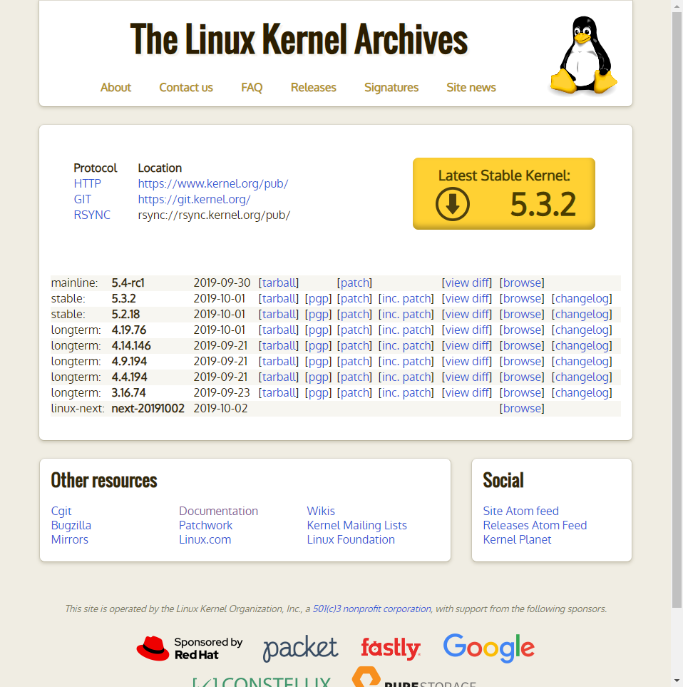

# 💎 Linux Kernel Güncelleme

## 🗽 Açıklama

- Bu yazı bir alıntı (türkçeleştirme) yazısıdır, orjinal halini görmek için [buraya](https://www.cyberciti.biz/tips/compiling-linux-kernel-26.html) tıklayabilirsin.
- Detayları merak etmiyorsan **🤸‍ Hızlı Kurulum** alanındaki yapman yeterlidir
- Detayları merak ediyorsan **⤵ Güncel Kernel Dosyasının İndirilmesi** alanından başlamalısın

## 🤸‍ Hızlı Kurulum

Detayları merak etmeyenler için hızlı kurulum 🏃‍

### ⚡ Çabuk Kurulum

Alttaki komutları direkt olarak kopyalayabilirsin.

```sh
VERSION=5.3.2
wget -O linux-VERSION.tar.xz https://cdn.kernel.org/pub/linux/kernel/v5.x/linux-$VERSION.tar.xz
xz -d -v linux-VERSION.tar.xz
tar xvf linux-VERSION.tar
cd linux-VERSION
cp -v /boot/config-$(uname -r) .config
sudo apt-get install -y build-essential libncurses-dev bison flex libssl-dev libelf-dev
```
### ⏲ Uzun Süren Kurulumlar 

Bu kısımdaki komutları satır satır kopyalamalısın.

> Yukarı komutları yazdığın dizinde olması lazım.

```sh
make -j $(nproc)
sudo make modules_install
sudo make install
sudo update-initramfs -c -k VERSION
sudo update-grub
reboot
```

## ⤵ Güncel Kernel Dosyasının İndirilmesi

[🐧 The Linux Kernel Archives](https://www.kernel.org/) sitesi üzerinden en güncel kernel sürümünü indirin veya alttaki komut ile indirmeyi 🖤 terminal üzerinden yapın:

> ❗ Hızlı kurulumu yaptıysan alttaki işlemlerin hiçbirini yapmana gerek yoktur.

```sh
wget -O linux-5.3.2.tar.xz https://cdn.kernel.org/pub/linux/kernel/v5.x/linux-5.3.2.tar.xz
```



## 📦 Kernel Kurulumu

### 🗃 Arşivden Çıkarma

İndirdiğiniz kernel dosyasının bulunduğu dizine girin. (Örn `cd ~/Downloads`)

> **Terminal üzerinden indirme yaptıysanız** zaten o dizinde olacağınızdan geçiş yapmanıza **gerek yoktur**.

**Ubuntu, Debian**:

```sh
xz -d -v linux-5.3.2.tar.xz
tar xvf linux-5.3.2.tar
```

**Diğer**:

```sh
unzx -v linux-5.3.2.tar.xz
tar xvf linux-5.3.2.tar
```

### ⚙ Yapılandırma Ayarlarını Aktarma

```sh
cd linux-5.3.2
cp -v /boot/config-$(uname -r) .config
```

**Örnek Çıktı**:

```sh
'/boot/config-5.0.0-23-generic' -> '.config'
```

### 🧰 Geliştirici Araçlarının Kurulumu

```sh
sudo apt-get install build-essential libncurses-dev bison flex libssl-dev libelf-dev
```

### ⚒ Kernel'i Derleme

Sıkıştırılmış kernel imajını derlemek için alttaki komutu yazın:

```sh
make -j $(nproc)
```

> `-j $(nproc)` komutu ile birden fazla işlemci çekirdeği kullanılır

### 🔆 Kernel Modüllerini Yükleme

```sh
sudo make modules_install
```

### ⏬ Kernel Yükleme

Alttaki komut ile aşağıdaki dosyaları `/boot` dizinine yükleyeceğiz

- initramfs-5.3.2.img
- System.map-5.3.2
- vmlinuz-5.3.2

```sh
sudo make install
```

## 👨‍🔧 Grub Yapılandırmasını Güncelleme

Grub2 yükleyicisinin yapılandırma ayarlarını yapmamız gerekmekte.

> Bu komutlar isteğe bağlıdır. make install işlemi bu işlemleri zaten yapmış olacaktır

```sh
sudo update-initramfs -c -k 5.3.2
sudo update-grub
```

## 🚀 İşlemleri Sonlandırma

- `reboot` ile sistemi yeniden başlatıyoruz
- Ardından `uname -mrs` ile linux kernel versiyonunu kontrol ediyoruz

**Örnek Çıktı**:

```sh
Linux 5.3.2 x86_64
```
