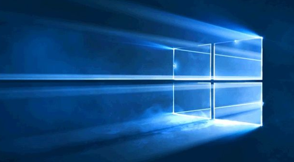

# 🚀 Sıfırdan Windows 10

## 👷‍ Windows 10 Kurulumu

Wİndows 10 son sürümünü indirmek için [buraya](https://www.microsoft.com/tr-tr/software-download/windows10) tıklayabilirsin.

**Media creating tools kullanmadan indirme:**

Siteye girdiğinizde sırasıyla alttaki ayarları açamınız | seçmeniz gerekmekte:

- Geliştirici Ayarları
- _Network conditions_
- _User Agent_ başlığı altında
  - _Select automatically_ seçimini kaldırın
  - _Safari – iPad iOS 9_
- Sayfayı yenileyin

> Detaylı bilgi için [buraya](https://pureinfotech.com/download-windows-10-iso-without-media-creation-tool/) tıklayabilirsin.

## 📦 Windows 10 Uygulamalarının Kurulumu

### 👜 Windows Store Üzerinden Uygulamarın Kurulumu

| Uygulama                                                                                                                   | Açıklama                                         |
| -------------------------------------------------------------------------------------------------------------------------- | ------------------------------------------------ |
| [🖼 Sharex](https://www.microsoft.com/tr-tr/p/sharex/9nblggh4z1sp?activetab=pivot%3Aoverviewtab)                           | Ekran görüntüsü alma                             |
| [🔍 Quick Look](https://www.microsoft.com/tr-tr/p/quicklook/9nv4bs3l1h4s?activetab=pivot:overviewtab)                      | Dosyaları açamadan <kbd>SPACE</kbd> ile önizleme |
| [🖤 Windows Terminal](https://www.microsoft.com/tr-tr/p/windows-terminal-preview/9n0dx20hk701?activetab=pivot:overviewtab) | Windows'un yeni şık terminali                    |
| [📝 Notepad](https://www.microsoft.com/tr-tr/p/notepad/9n7lrq8p8pd5?activetab=pivot:overviewtab)                           | Sade tasarımlı not defteri                       |
| 📔 OneNote                                                                                                                 | Not alma uygulaması (Gömülü olarak gelir)        |

> Store üzerinden indirilen Python, Git Bash üzerinden kullanılamıyor (`Permission denied`). Bu yüzden store'dan değil web sitesinden indirilmeli. 

### 🤸‍ Store Uygulamları için Kişiselleştirmelerim

- [Sharex yapılandırma ayarlarım](https://drive.google.com/uc?id=18qJhuV9gOZYnRBdKklEA0UmMnwyJO8xV)
- [Windows terminal yapılandırma ayarlarım](https://gist.github.com/yedhrab/748ed0216864c3ea0dea224d988c97cb)

### 🌤 İnternet Üzerinden Uygulamaların Kurulumu

| Uygulama                                                                                  | Açıklama                                       |
| ----------------------------------------------------------------------------------------- | ---------------------------------------------- |
| [🌍 Chrome](https://www.google.com/chrome/)                                               | Tarayıcı                                       |
| [👨‍💻 VsCode](https://code.visualstudio.com/download)                                    | Kodlama için editör                            |
| [㊙ FiraCode](https://github.com/tonsky/FiraCode)                                         | Kodlama fontu (`ttf` dizinindekiler kurulacak) |
| [🗃 Winrar](https://www.win-rar.com/download.html?&L=0)                                   | Sıkıştırılmış dosyaları açma                   |
| [📨 Rambox](https://rambox.pro/#pricing)                                                  | Mesajlaşma uygulamalarının yönetimi            |
| [🛠 Git](https://git-scm.com/downloads)                                                   | Proje versiyon yönetim uygulaması              |
| [🐙 Github Desktop](https://desktop.github.com/)                                          | GitHub için yönetim uygulaması                 |
| [🏢 Office](https://bit.ly/2kjVZe9)                                                       | MS Office                                      |
| [📂 Backup and Sync](https://www.google.com/drive/download/backup-and-sync/)              | Drive backup                                   |
| [🖱 Numix Cursor Theme](https://drive.google.com/uc?id=1odtFIqAEfnvBH5Zk5ZefPnm77kZIxxQp) | Mouse teması                                   |
| [🖼 PaintNet](https://www.dotpdn.com/downloads/pdn.html)                                  | Resim düzenleme uygulaması                     |

> 🔧 PaintNet'i varsayılan resim editörü yapmak için [Registery Scriptlerim](./Registery%20Scriptlerim) alanındanki [PaintNet'i varsayılan resim editörü yapma](./Registery%20Scriptlerim/PaintNet%27i%20varsay%C4%B1lan%20resim%20edit%C3%B6r%C3%BC%20yapma.reg) aracını kullanabilrisin.

### 🤸‍ İnternet Uygulamları için Kişiselleştirmelerim

- 🎇 Chrome eklentilerin:
  - [The Great Suspender](https://chrome.google.com/webstore/detail/the-great-suspender/klbibkeccnjlkjkiokjodocebajanakg?hl=en)
  - [Google Translate](https://chrome.google.com/webstore/search/translate?hl=en)
  - [OneTab Plus:Tab Manage & Productivity](https://chrome.google.com/webstore/detail/onetab-plustab-manage-pro/lepdjbhbkpfenckechpdfohdmkhogojf?hl=en)
  - [Grammarly for Chrome](https://chrome.google.com/webstore/detail/grammarly-for-chrome/kbfnbcaeplbcioakkpcpgfkobkghlhen?hl=en)
  - [Ad Block Plus](https://chrome.google.com/webstore/detail/adblock-plus-free-ad-bloc/cfhdojbkjhnklbpkdaibdccddilifddb)
  - [Popup Blocker](https://chrome.google.com/webstore/detail/pop-up-blocker-for-chrome/bkkbcggnhapdmkeljlodobbkopceiche)
- ⚒ Git kurulumu kişiselleştirmem:
  - **Windows explorer entegration** kapalı
  - **Use Visual Studio Code as Git's default editor**
  - **Use Git and optional Unix Tools from the Command Prompt**
  - Bash komutlarını windows terminalde kullabiliriz
  - **Use default windows console window**
- 🥧 VsCode kişiselleştirmemi [Settings Sync](https://marketplace.visualstudio.com/itemdetails?itemName=Shan.code-settings-sync) eklentisi yardımıyla [GitHub Gist](https://gist.github.com/yedhrab/4b13743a36cece5c3c22a5042897a83d)'im üzerinden çekebilirsin
- Backup and Sync için, PC açıldığında otomatik olarak açılmasını iptal et
  - Sağ alttaki ☁ ikonuna sağ tık
  - **Üç nokta ikonu** - **Pereferences** - **Settings** - **Open Backup when system starts** işarteni kaldır

## ⚙ Windows 10 Sistem Ayarları

###  Temel Sistem Ayarları

- Sağ alttaki ☁ ikonundan **Ayarlar** - **Ayarlar** sekmesi - **Bİlgisayar başlatıldığında OneDrive'ı başlat** seçeneğini iptal etme
- **Ayarlar** - **Sistem** - **Hakkında** - **Yeniden adlandır** ile PC'yi yeniden adlandırma
- **Ayarlar - Hesap** kısmından kullanıcı hesabı ile giriş yapma
- **Mail** uygulamasından e-posta hesabı girme
- **Gelişmiş klavye ayarları**'dan **Emoji Panel** kısmındaki işareti kaldırma
  - Birden fazla klavye varsa varsayılanı seçmek
- <kbd>❖ Win</kbd> tuşuna basıp, ayarlar resmine sağ tıklayıp **Bu listeyi özelleştir** üzerinden gözükecek klasörleri ayarlama

### 🔑 Otomatik Olarak Oturum Açma

- İlk olarak <kbd>❖ Win</kbd> + <kbd>R</kbd> ile `Run` alanını açın
- Çıkan ekrana `netplwiz` yazın ve <kbd>ENTER</kbd>'a basın
- Kutucuğun işaretini kaldırın ve gerekli alana şifrenizi girip `APPLY` butonuna basın

### 🍢 Görev Çubuğu Ayarları

<kbd>❖ Win</kbd> + <kbd>1 2 3 ...</kbd> tuşları ile otomatik açılır 

- Windows Terminal
- Chrome
- VsCode
- File Explorer
- Notepad

## 📂 Temel Dizinler

Alttaki komutları <kbd>❖ Win</kbd> + <kbd>R</kbd> ile açılan **run** pencerisine yazmanız gerekmekte.

- `shell:startup` Başlangıçta çalışan uygulamalar
- `shell:AppsFolder` Tüm uygulamalar

## 🗄 Uygulama Verileri

- `C:\Users\%username%\AppData\Roaming` yani `%appdata%` dizininde yer alır.
  - Arama yerine `%appdata%` yazarak erişebilirsin
- `C:\Users\%username%\AppData\Local`
- `C:\ProgramData`
