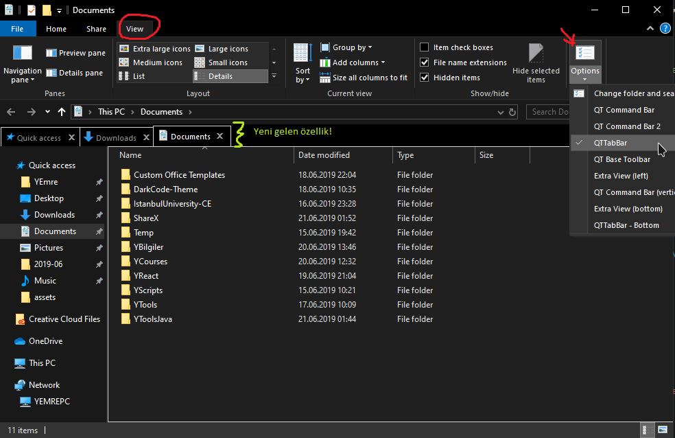
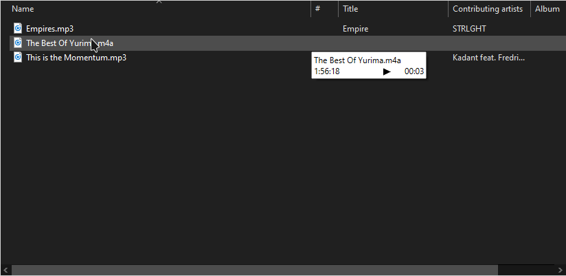

# Windows10 Gelişmiş <!-- omit in toc -->

## İçerikler <!-- omit in toc -->

- [Otomatik Giriş Yapma](#Otomatik-Giri%C5%9F-Yapma)
- [Dizin Resmini Değiştirme](#Dizin-Resmini-De%C4%9Fi%C5%9Ftirme)
- [Resim Düzenleyicisini Değiştirme](#Resim-D%C3%BCzenleyicisini-De%C4%9Fi%C5%9Ftirme)
- [Bat Düzenleyiciyi Değiştirme](#Bat-D%C3%BCzenleyiciyi-De%C4%9Fi%C5%9Ftirme)
- [Telemetry'i Kapatma](#Telemetryi-Kapatma)
- [Windows Store Uygulama Dizini](#Windows-Store-Uygulama-Dizini)
- [File Explorer'ı Geliştirme](#File-Explorer%C4%B1-Geli%C5%9Ftirme)
- [Windows 10 Composer](#Windows-10-Composer)
- [Windows10 Karanlık Tema Kurulumu](#Windows10-Karanl%C4%B1k-Tema-Kurulumu)
- [Windows Saat Sorunu](#Windows-Saat-Sorunu)
  - [Yerel Saati Kullanma](#Yerel-Saati-Kullanma)
  - [Evrensel (UTC) Saati Kullanma](#Evrensel-UTC-Saati-Kullanma)
  - [Windows Boot Kurtarma](#Windows-Boot-Kurtarma)
- [Harici Bağlantılar](#Harici-Ba%C4%9Flant%C4%B1lar)

## Otomatik Giriş Yapma

Her defasında şifre girişi yapmaz istemezseniz, otomatik şifre girmek sizin için faydalı olacaktır.

- Arama yerine `netplwiz` yazın ve <kbd>ENTER</kbd>'a basın
- Çıkan alandaki kutucuğun işaretini kaldırın
- Şifrenizi girin ve onlayın

## Dizin Resmini Değiştirme

Dizin resimleri içerisindeki `desktop.ini` dosyası ile değiştirilmekte

- IconResource alanına `*.ico` resminizin yolunu verin
- `0` değeri ilk resim anlamına gelmektedir, **değiştirmeyiniz**

```ini
[.ShellClassInfo]
IconResource=.\instabot.ico,0
[ViewState]
Mode=
Vid=
FolderType=Documents

```

## Resim Düzenleyicisini Değiştirme

- Arama alanına `regedit` yazıp <kbd>ENTER</kbd>'a basın
- Çıkan ekranda `Computer\HKEY_CLASSES_ROOT\SystemFileAssociations\image\shell\edit\command` dizinine gelin
- Default adlı anahtarın değerini `"C:\Program Files\paint.net\PaintDotNet.exe" "%1"` olarak değiştirin
  - Orjinal veri: `"C:\Windows\system32\mspaint.exe" "%1"`

> Program yolunu istediğiniz gibi ayarlayabilirsiniz

## Bat Düzenleyiciyi Değiştirme

- `HKEY_CLASSES_ROOT\batfile\shell\edit\command`

> [Stackoverflow kaynağı](https://superuser.com/a/728159/1046035)

## Telemetry'i Kapatma

> Telemetry windows'a geribildirim yapan bir servistir.

- Kapatmak için [bu siteye](https://blogs.systweak.com/how-to-disable-telemetry-and-data-collection-in-windows-10/) bakabilirsin
- İstersen regedit değişimini; alttaki metni `txt`'te kaydedip, uzantısı `reg` yapıp çalıştırarak uygulayabilirsin

<details>
<summary>*.reg dosyası</summary>

```reg
Windows Registry Editor Version 5.00

[HKEY_LOCAL_MACHINE\SOFTWARE\Policies\Microsoft\Windows\DataCollection]
"AllowTelemetry"=dword:00000000
```

</details>

## Windows Store Uygulama Dizini

- Here is the path you should follow: C:Program Files.
- Go to View and check the box next to Hidden items.
- Locate the Windows Apps folder and right-click on it.
- Select Properties from the drop-down menu.
- Select Security. Then select Advanced.
- Go to Owner. There click Change.
- Enter Microsoft account email address.
- Check the box next to ‘Replace owner on subcontainers and objects’.
- Apply your changes.
- Locate and click your account in the list. Click Edit.
- Check the box next to Full Control.

## File Explorer'ı Geliştirme

Alttaki işlem ile file explorer'a hem **tab** hem de **önizleme** fonksiyonu eklebilirsin.

- İlk olarak [QTTabBar](http://qttabbar.wikidot.com/) sitesine girin
- [QTabBar ver 1038](http://qttabbar.wdfiles.com/local--files/qttabbar/QTTabBar_1038.zip)'i indirin
- Ardından update kurulumu olan [QTTabBar ver 1040](http://qttabbar.wdfiles.com/local--files/qttabbar/UpdateQTTabBar1040.zip) ile güncelleyin
- Resimdeki gibi özelleştirebilirsin

> İstersen [buradan](https://www.raymond.cc/blog/how-to-have-tabs-in-your-windows-explorer/) diğer seçenekleri de deneyebilirsin.




## Windows 10 Composer

> [Buradan](https://github.com/samhocevar/wincompose) detaylara erişebilirsin.

## Windows10 Karanlık Tema Kurulumu

En çok sevilen karanlık tema olan [Nocturnal] temasını kurmak için:

- Kurulum dosyasını [buradan][nocturnal - download] indirin ve `zip` halinden çıkarın , eğer bu link çalışmaz ise sitesinden erişebilirsiniz
- Güvenlik amaçlı _System Geri Dönüşüm Noktası_ oluşturun
- İndirdiğiniz dosyada `Blank Caption Text` dizine girin ve içerisinde bulunan `Blank.ttf` dosyasına sağ tıklayın ve `Yükle` deyin
- Ardından `Blank.reg` dosyasını çalıştırın
  - Bu değişikliği geri almak isterseniz `Default.reg` dosyasınını kullanabilirsiniz
- `Visual Style` dizinindeki seçtiğiniz bir version ismine sahip olan klasörün **içindekileri** kopyalayın ve `C:\Windows\Resources\Themes` dizinine yapıştırın
- [UltraUXThemePatcher] ile bilgisayarınıza tema yamasını kurun
- _Settings > Personalization > Themes > Select the theme_
- Dosya gezginindeki en üstteki çubuğu kaldırmak (_ribbon_) için:
  - [OldNewExplorer] programını indirin ve çıkartarak `.exe` uzantılı dosyayı **yönetici olarak** çalıştırın
  - `Use commond bar instead of ribbon` kutucuğunu seçin
    - Altındaki kutucuklardan sadece `Use alternate navigation button style` olanı seçin
  - `Show status bar` kutucuğunun seçimini kaldırın
  - `Install` butonuna tıklayın
- Tüm işlemler bittiğine göre artık, Ayarlar > Kişiselleştirme > Tema kısmından `Nocturnal` temasını seçebilirsiniz

## Windows Saat Sorunu

Windows yanına linux kurulmasında gerçekleşen bu sorunun çözümü **yerel saati** kullanmaktır.

> Alttaki metinleri dosya açıp içine kopyaladıktan sonra, dosya uzantısını `reg` yapın ve çalıştırın.

### Yerel Saati Kullanma

```reg
Windows Registry Editor Version 5.00

[HKEY_LOCAL_MACHINE\System\CurrentControlSet\Control\TimeZoneInformation]
"RealTimeIsUniversal"=-
```

### Evrensel (UTC) Saati Kullanma

```reg
Windows Registry Editor Version 5.00

[HKEY_LOCAL_MACHINE\System\CurrentControlSet\Control\TimeZoneInformation]
"RealTimeIsUniversal"=dword:00000001
```

### Windows Boot Kurtarma

```bat
diskpart
list disk
sel disk 0

list vol
sel vol 2
assign letter=G:

cd /d G:\EFI\Microsoft\Boot\
bootrec /fixboot

ren BCD BCD.old
bcdboot C:\Windows /l tr-tr /s G: /f ALL

exit
```

> [Kaynak](https://www.easeus.com/partition-manager-software/fix-uefi-boot-in-windows-10-8-7.html)

## Harici Bağlantılar

- [Windows yanına linux kurulduğunda windows saatinin bozulması]

[nocturnal]: https://www.deviantart.com/chloechantelle/art/Nocturnal-W10-582106490
[nocturnal - download]: https://www.deviantart.com/download/582106490/d9mkk8q-d0678559-518e-48f3-bf36-30bd91f73496?token=53c9fe62794d3574b12d5aad67c1998665b93c20&ts=1558436081
[ultrauxthemepatcher]: https://www.deviantart.com/users/outgoing?https://www.syssel.net/hoefs/software_uxtheme.php?lang=en
[oldnewexplorer]: https://tihiy.net/files/OldNewExplorer.rar
[windows yanına linux kurulduğunda windows saatinin bozulması]: https://www.howtogeek.com/323390/how-to-fix-windows-and-linux-showing-different-times-when-dual-booting/
